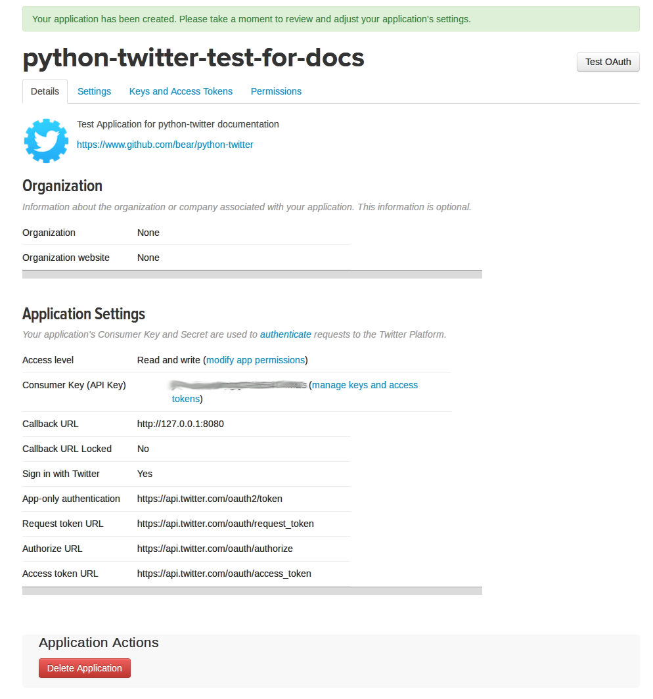

<!--title={Creating An App and Keying In Authorization Keys}-->

### Step 1: Creating an App 

Head over to your Twitter Developer Account and create an app. Fill out the fields on the next page that looks like this:


After your app is created, you will see a new page that shows all the information you need.




### Step 2: Keying In Authorization Keys

Copy the information needed and create the following keys: `consumer_key`, `consumer_secret`, `access_token_key`, `access_token_secret`, and declare the keys as follows:

```python
consumer_key = '<your_consumer_key>'
consumer_secret = '<your_consumer_secret>'
access_token_key = '<your_access_token_key>'
access_token_secret = '<your_access_token_secret>'
```

It's important to use the quotation marks (both `'` or `"` work, just make sure you are consistent about which one you use), otherwise it may cause problems in the program! We will be using these to authorize our Twitter API. 
