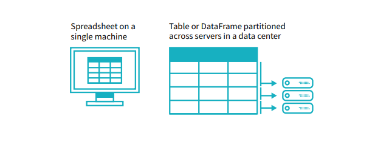

<!--title={Creating A Data Frame Of Tweets}-->

Now we could make `bg2`, a list, into `bg3`, a two-dimensional size-mutable tabular data structure **dataframe**.

### Step 1: Create a Dataframe

After we have obtained our cleansed tweets in `bg2`, we create a new variable `bg3` that makes `bg2` into a data frame using the `DataFrame` function from the `pandas` library.

### Step 2: Check How It Goes!

Check it by printing out `bg3` to check for the right data frame output.

