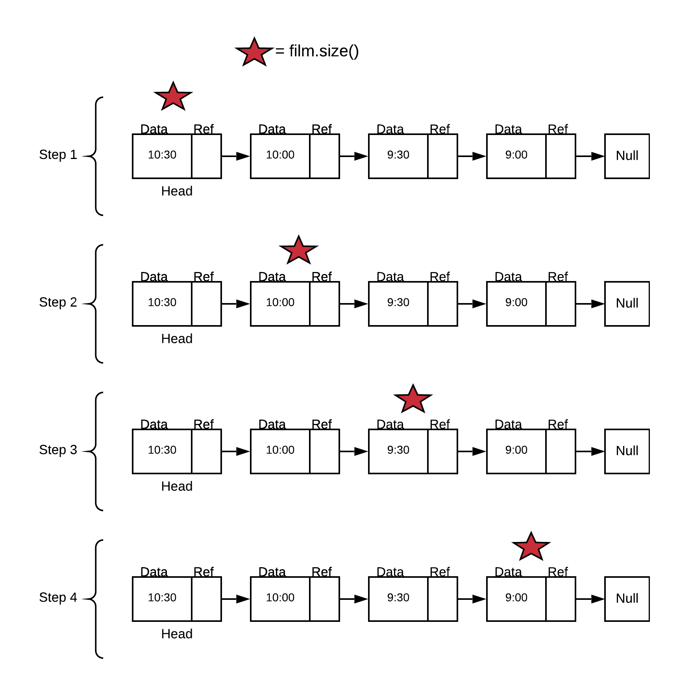

<!--title={Size of a Linked List}-->

<!--badges={Algorithms:10}-->

<!--concepts={Size of a Linked List}-->

In order to find the size of a linked list, we can define our `size()` function as being able to count nodes until it doesn't find any more, and return the amount of nodes it found.

The method begins with the "head" node and travels through the list using the `next_node` pointers to reach the next node until the `current` node becomes None. At that point, it will return the number of nodes encountered along the way. 

```python
def size(self):
    current = self.head
    count = 0
    while current:
        count += 1
        current = current.get_next()
    return count
```
The time complexity of size is O(n) because each time the method is called, it will always visit every node in the list but only interact with them once, so n * 1 operations.

Calling our `size()` function should look like this: 

```python
print(film.size())
```
In the visual example below, `size()` should return a size of 4 nodes.



To further implement a linked list, we'll see that the `search()` function is actually very similar to `size()`.
