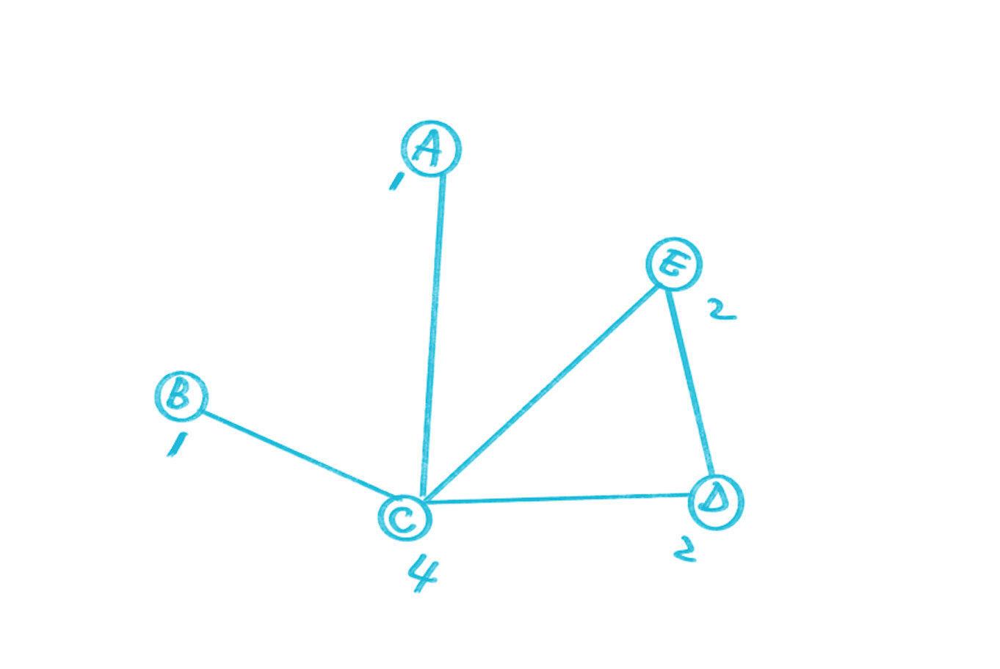
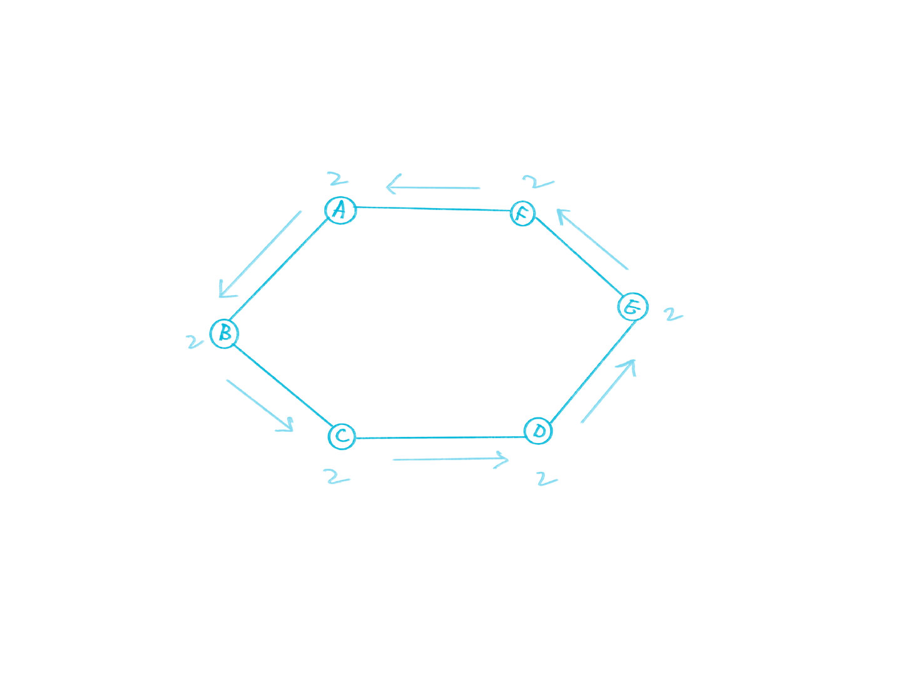

<!--title={Undirected Graphs}-->

<!--badges={Algorithms:5,Python:5}-->

<!--concepts={Hamiltonian Path and Hamiltonian Cycle}--> 

## Hamiltonian Path and Hamiltonian Cycle

Instead of focusing on edges, now we are going to focus on vertices.

A **Hamiltonian Path**  is a path that visits every vertex once.

A **Hamiltonian Cycle** is a Hamiltonian Path that begins and ends at the same vertex.

**Königsberg Bridge Problem**

There are seven bridges in the city. The question is is it possible to cross all the seven bridges once to walk though the whole city. 

In order to solve the problem, Euler turn the map in to a graph. Each island or land are represent as vertices, and each bridge are repersent as edges connected the vertices.

There  is no Euler Path, cause there are too many vertices with odd edges. In order to visit all the bridges people have to revisit the land or island.

Another sample of a graph that doesn't have **Hamiltonian Path**

Note that there are two vertices `A` `B`  have odd degree.

Example of **Hamiltonian Path**   

This graph  have **Hamiltonian Path** `A` `B` `C` `D` `E` `B`. But it doesn't have a **Hamiltonian Cycle** 

Example of **Hamiltonian Cycle**   

You can choose whatever vertice you want and follow the same direction until you return to the first vertice 

