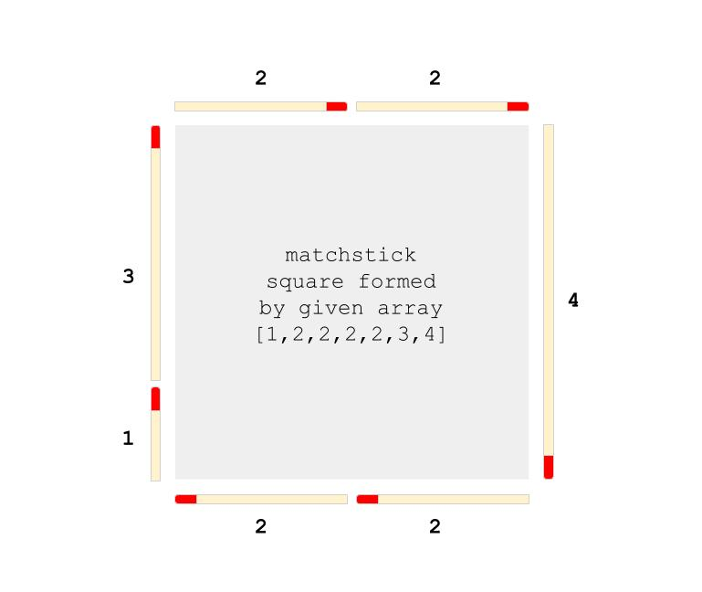

<!--title={Matchsticks to Square}-->

<!--badges={10}-->

Now that we have learned how to implement various searching algorithms, use the knowledge and code we have developed throughout this activity to figure out how to solve this problem:

Remember the story of Little Match Girl? Let's imagine that we buy a pack of matchsticks from the girl and, with our matchsticks of assorted lengths, try to find out whether or not we can make one square by using up all the given matchsticks. We cannot *not* break any stick, but we can link them up, and each matchstick must be used *exactly* one time.

Our input will be the given matchsticks we purchased, represented by integers of their lengths. Our output will either be true or false, to represent whether or not we could make one square using all the matchsticks from the pack we bought from the Little Match Girl.

**Note these restrictions:**

- The number of given matchsticks in the inputted array will not exceed `15`.
- The sum of the lengths of the given matchsticks is in the range of `0` to `10^9`.



Below are examples of what our inputs may look like and what our outputs should look like: 

**Example 1:**

```
Input: [1,1,2,2,2]
Output: true

# Explanation: You can form a square with each side having the length of 2, with one side of the square formed with the two sticks that each have the length of 1.
```

**Example 2:**

```
Input: [3,3,3,3,4]
Output: false

# Explanation: You cannot find a way to form a square with all the matchsticks.
```

