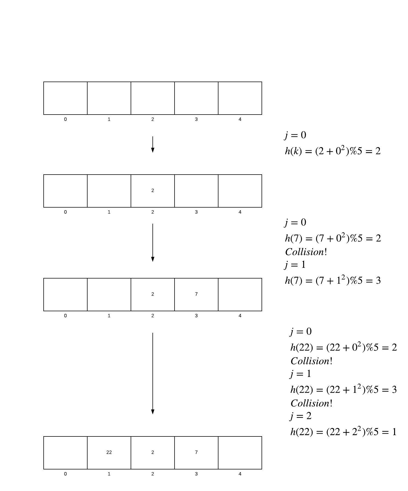

# Hash Tables - Quadratic Probing

### Motivation

In Hash Tables, when there is a collision, we must have a collision resolution technique when keys are hashed to the same bucket. Quadratic Probing is an example of a collision resolution technique. This technique is a part of open addressing.

### Preliminary Information1 

* We define our hash function to be h(k) = (k+j2) % (size of table)
* We define j as a counter variable which is initialized to 0 when attempting to insert an element into the hash table. If, when using the hash function, we have a collision, we increment j and recalculate where to insert the element using the new hash function.

### Example2

Quadratic probing is best demonstrated through an example.

Say that we have a hash table of size 5. Let's try to insert the numbers 2, 7, and 22.

Notice how everytime there is a collision, we increment j and reapply the hash function h(k) = (k+j2) % (size of table).

1 Methodology credit to https://www.youtube.com/watch?v=BoZbu1cR0no

2 Original example, but inspired by https://www.youtube.com/watch?v=BoZbu1cR0no 

 

