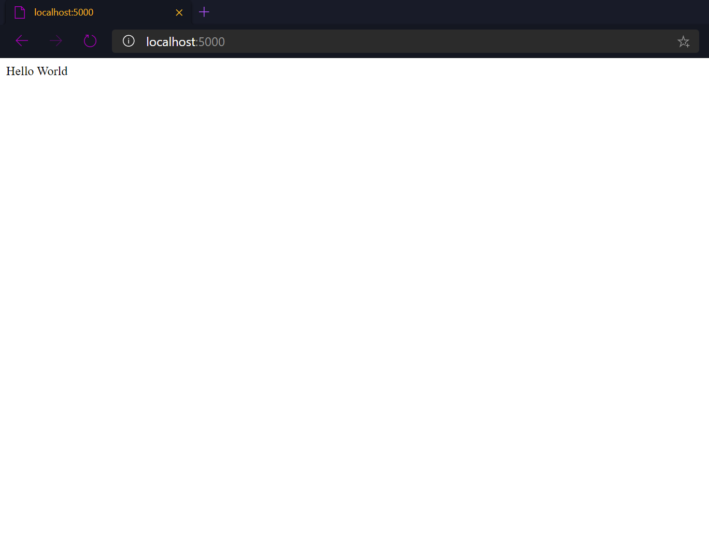

<!--title={Creating Server.js and Index.ejs}-->

 We still need to do some extra prep work first. Edit your package.json file to have a start script called `devStart` which will run a JavaScript file called `server.js` using `nodemon`. Remember that this will make sure that our server will refresh immediately whenever we make changes to `server.js` in any way.

Now, it's time to actually create `server.js`. This file will contain the bulk of the code for your application.

First, create a bare-bones server using Express. Set the listening port to whatever is in in the process environment's port variable, and 5000 as a default if this isn't set.

At this point, you can run the server, but you will see this error `Cannot GET /`. This is because you haven't set a route to your index file yet. Create a file called `index.ejs` in a folder called `views` . The reason why you are using an `ejs` file is because that was the templating language that you are utilizing. Templating languages allow you to combine HTML markup with the capabilities of a real programming language. You will need this feature later on. Fill this file with a simple phrase, like 'Hello World.'

In order for you to be able to utilize this file properly, you will need to use `ejs`' **view engine**. A view engine is responsible for creating HTML from your **views**, while views are combinations of HTML and programming languages. Set the view engine to `ejs` and render the index file. You should see your phrase or `Hello World` displayed in your browser.

At this point, your browser should look like this:

